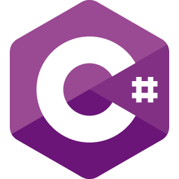
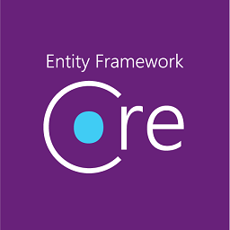

- 👋 Hi, I’m Dina Issa
- 👀 I’m interested in Game Development
- 🌱 I’m currently learning node js backend
- 📫 Reach me at: dj.developer.ri@gmail.com

 

 

### 🔨 Languages and Tools:   

 
 

<!---
dinaJamal/dinaJamal is a ✨ special ✨ repository because its `README.md` (this file) appears on your GitHub profile.
You can click the Preview link to take a look at your changes.
--->
